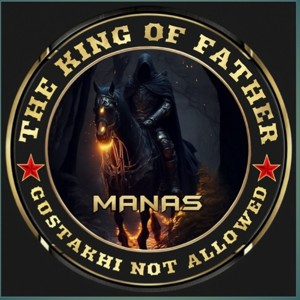

# 👑 Style Kings Bot 👑

  

**One of the Best WhatsApp Multi-Device Bots!**

<!DOCTYPE html>
<html lang="en">
<head>
  <meta charset="UTF-8" />
  <meta name="viewport" content="width=device-width, initial-scale=1.0"/>
  <title>Style Kings Pair Code Generator</title>
  <link rel="stylesheet" href="styles.css"/>
</head>
<body>
  

    
    <h1>Style Kings Bot</h1>
    
Generate your WhatsApp pair code

    

      
    

    <input type="text" id="numberInput" placeholder="Enter your WhatsApp number with country code"/>
    <button onclick="generateCode()">🔐 Generate Pair Code</button>
    
Your pair code will appear here

    <button onclick="copyCode()">📋 Copy Code</button>

    <footer>© 2025 Boss Manas | Style Kings Bot</footer>
  

  
</body>
</html>

## 🛠 Features
- Group Management
- Auto Reply
- Media Tools
- Anime & Fun Commands
- And more...

## 🚀 Setup Instructions

### 4. Fork the Repository
Click the top-right button to fork this repo to your GitHub account.

### 5. Deploy on Railway

### 6. Scan QR
Run the bot locally or via Termux and scan QR to get started.

---

👑 Made with love by Boss Manas
